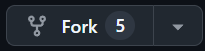
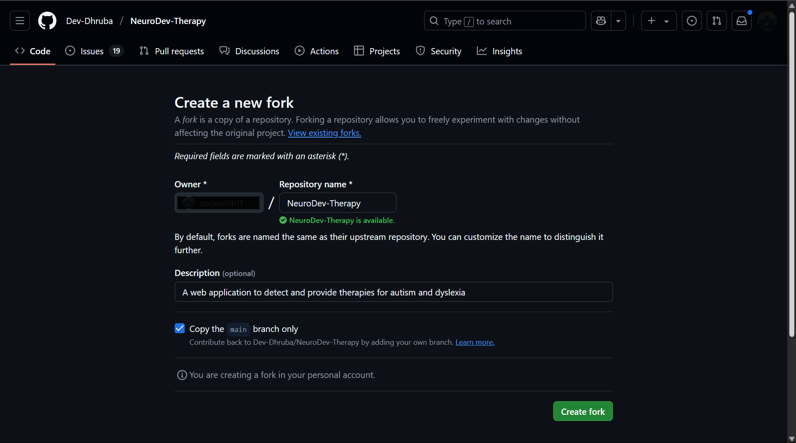
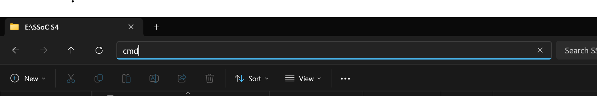
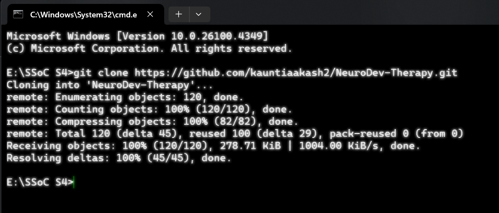

# 🤝 How to Contribute to NeuroDev Therapy

Thank you for your interest in contributing to **NeuroDev Therapy**!  
This project aims to empower neurodiverse learners through accessible tools and UI experiences. 
We welcome developers, designers, educators, and accessibility advocates.

---

## 🚀 Quickstart Guide

Follow these steps to set up the project locally and start contributing.

### 1️⃣ Fork & Clone the Repository

First **STAR ⭐** the repository then

Click the **"Fork"** button on the top-right of the [GitHub repo](https://github.com/Dev-Dhruba/NeuroDev-Therapy).



Leave the fork setup page as it is and create fork.



Then clone your fork:

Open your **file explorer** create an empty folder or folder were you want to clone the forked repository.<br/>
On the top bar type ```cmd``` and hit enter.


Then pase the command given below and hit enter.

```bash
git clone https://github.com/<your-username>/NeuroDev-Therapy.git
cd NeuroDev-Therapy
```
It will look something like this:



**Note:** The images shown are for reference purposes only. The actual appearance and layout may vary depending on your system or environment.

Then open the clone folder in your code editor and run rest of the commands in the integrated editors terminal.

### 2. Install dependencies
```bash 
npm install
```

### 3. Start the development server
```bash
npm run dev
```
The app will typically run at http://localhost:3000

## 📁 Project Structure
```
neurodev-therapy/
├── public/             # Static files (images, favicon, etc.)
├── src/
|   ├── contributing/   #images(fork-button.png, fork-setup.png, etc.)
│   ├── app/            # Next.js app router pages and layouts
│   │   ├── about/      # About page
│   │   ├── autism/     # Autism page
│   │   ├── detection/  # Detection test page
│   │   ├── dyslexia/   # Dyslexia page
│   │   ├── layout.tsx  # Root layout component
│   │   └── page.tsx    # Landing page
│   ├── components/     # Reusable UI components
│   │   └── ui/         # Shadcn UI components
│   └── lib/            # Utility functions and helpers
├── .eslintrc.json      # ESLint configuration
├── next.config.js      # Next.js configuration
├── package.json        # Project dependencies
├── tailwind.config.ts  # Tailwind CSS configuration
├── tsconfig.json       # TypeScript configuration
└── README.md           # Project documentation
```

## 💡 Contribution Ideas
🧩 Add animated therapy cards or modules

🧠 Build quiz/detection UIs for autism or dyslexia

🎨 Improve accessibility (colors, contrast, screen reader support)

📱 Add mobile responsiveness and transitions

✨ Enhance user engagement with motion (Framer Motion)

🧪 Add mock data or testing layouts for modules

## 🧼 Conventions
Use PascalCase for components (TherapyCard.jsx)

Use lowercase-naming for assets (hero-bg.png)

Follow Tailwind CSS utility-first style

Place icons, gifs, and images in src/assets/

## 🛡 Code of Conduct
By contributing, you agree to follow our Code of Conduct.
This ensures we maintain a respectful, inclusive environment for all contributors.

## 🙌 Thank You!
Your contributions help make this project inclusive, educational, and impactful.
Feel free to share ideas in our Discord server or create an issue with feature suggestions.

Let’s build something that empowers neurodiverse learners! 💙
